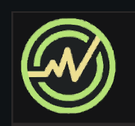
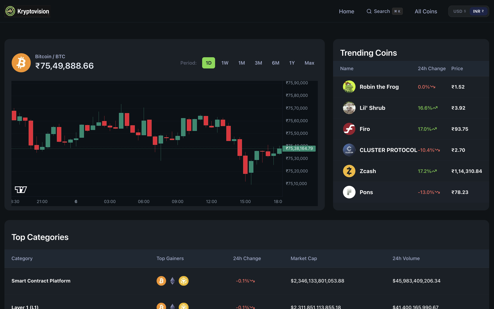
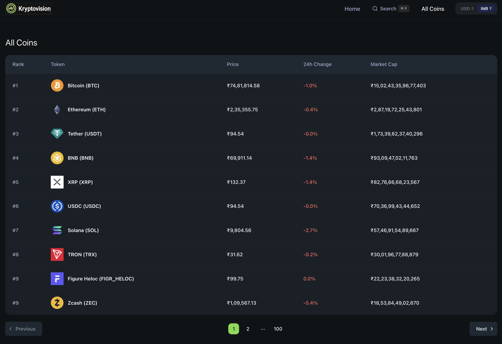

# KryptoVision - Real-Time Crypto Analytics & Trading Terminal

<p align="center">
  
</p>

KryptoVision is a high-performance, state-of-the-art cryptocurrency screening and real-time trading terminal built with Next.js 16 (App Router), React 19, TypeScript, and Tailwind CSS. It features interactive TradingView candlestick charts, a **Dual-Engine Real-Time WebSocket Streaming System** (CoinGecko Pro & Binance fallback), live multi-currency (USD/INR) price formatting, DEX liquidity pool tracking, and an instant command palette search modal.

**Live Demo:** [KryptoVision](https://kryptovision.vercel.app)

---

## Screenshots

### User Experience & Real-Time Dashboard


### Cryptocurrency Screener & Market Rankings


---

## Key Features

- **Dual-Engine WebSocket Streaming**: Live 1s/1m price ticker updates, recent order book trade streams, and candlestick updates via CoinGecko Pro with an automatic failover to Binance Public WebSockets.
- **Interactive Technical Candlestick Charts**: Canvas-rendered financial charts powered by TradingView `lightweight-charts` with period controls (1D, 1W, 1M, 3M, 6M, 1Y, Max) and responsive auto-scaling.
- **Global USD & INR Currency Switcher**: Real-time currency toggle persisting user preferences in `localStorage` and fetching live exchange rates for instant price conversions across all metrics.
- **Command Palette Quick Search (`⌘K`)**: Fast modal search powered by `cmdk` and SWR, providing instant token autocomplete and trending coins recommendations.
- **DEX Pool & On-Chain Tracking**: Automatic detection of DEX liquidity pools and contract addresses via GeckoTerminal API for accurate token charting.
- **Instant Multi-Currency Converter**: Interactive crypto-to-fiat and crypto-to-crypto converter supporting dozens of global currencies.
- **Secure Full-Stack Next.js Architecture**: Server Actions isolate sensitive CoinGecko API keys on Node.js runtime to prevent client-side credential exposure.

---

## System Architecture

```
User Browser (React 19 / Client Components)
   │
   ├──────► [Next.js Server Actions Layer ('use server')] ──► [CoinGecko REST API]
   │           └─ Encapsulates API keys & handles data fetching
   │
   └──────► [Dual-Engine Real-Time WebSocket Hook]
               │
               ├──► [Primary: CoinGecko Pro WebSocket] (Requires API Key)
               │       └─ Stream: SimplePrice / OnchainTrade / OnchainOHLCV
               │
               └──► [Fallback: Binance Public WebSocket] (Zero Key Required)
                       └─ Stream: @ticker / @trade / @kline_1s / @kline_1m
```

---

## Tech Stack

### Frontend & UI
- **Next.js 16** (App Router & Turbopack)
- **React 19** with **TypeScript**
- **Tailwind CSS v4** & **Shadcn UI** primitives
- **TradingView `lightweight-charts` v5**
- **cmdk** & **Lucide React** icons

### Data Fetching & Real-Time Engine
- **Next.js Server Actions** (`'use server'`)
- **SWR** (Stale-While-Revalidate caching)
- **Native WebSocket API** (CoinGecko Pro WS + Binance Public Stream WS)
- **Query-String** & **Open Exchange Rates API**

---

## Setup & Installation

### Prerequisites
- Node.js (v20 or higher)
- npm or pnpm
- (Optional) CoinGecko API key for pro features (falls back to Binance public stream automatically)

---

### 1. Clone the Repository

```bash
git clone https://github.com/Anshr23/Crypto-Trading.git
cd Crypto-Trading
```

---

### 2. Environment Configuration

Create a `.env.local` file in the root directory:

```env
# Server-Side API Variables (Hidden from browser)
COINGECKO_BASE_URL=https://api.coingecko.com/api/v3
COINGECKO_API_KEY=your_coingecko_api_key_here

# Client-Side WebSocket Variables (Optional - Auto-falls back to Binance Free WebSocket)
NEXT_PUBLIC_COINGECKO_API_KEY=your_public_coingecko_key
NEXT_PUBLIC_COINGECKO_WEBSOCKET_URL=wss://stream.coingecko.com/v1
```

---

### 3. Local Development Startup

```bash
# Install dependencies
npm install

# Run the dev server
npm run dev
```

Open `http://localhost:3000` in your browser.

---

## Server Actions & API Services

### CoinGecko Actions (`lib/coingecko.actions.ts`)
- `fetcher<T>(endpoint, params)` — Generic server action wrapper for authenticated CoinGecko REST calls.
- `getPools(id, network, contractAddress)` — Retrieves DEX liquidity pool data from GeckoTerminal.
- `searchCoins(query)` — Handles server-side coin autocomplete queries.
- `getTrendingCoins()` — Fetches top trending crypto assets (cached for 300s).

### Real-Time WebSocket Hook (`components/hooks/useCoinGeckoWebSocket.ts`)
- Primary WebSocket connection to CoinGecko Pro WS (`C1` price, `G2` trade, `G3` candle streams).
- Fallback connection to Binance stream (`@ticker`, `@trade`, `@kline_1s`, `@kline_1m`).

---

## License

Distributed under the MIT License.

